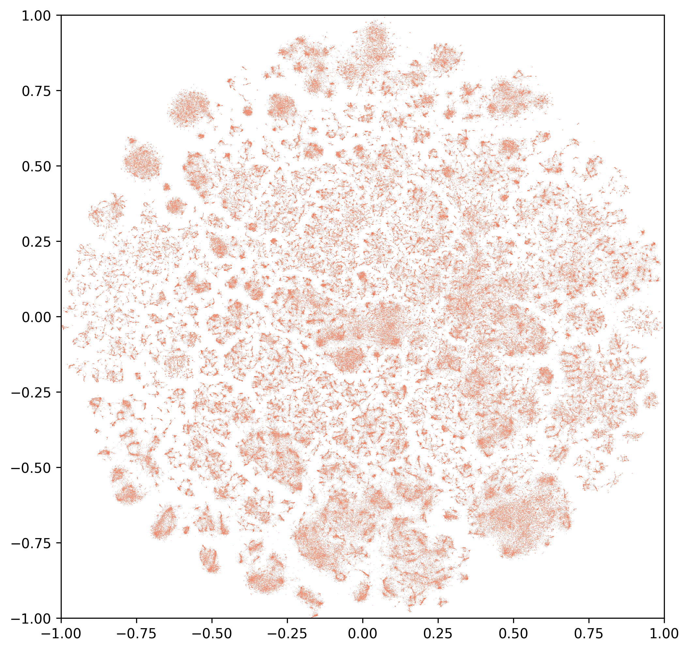
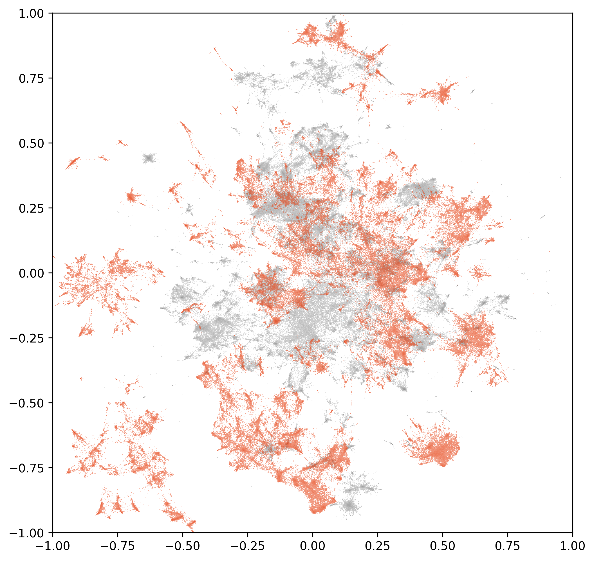

<!--
notes
-->

Academic Methodologies 
Supervised by Prof. Dr. Lena Gieseke 
Creative Technologies @ Filmuniversity Babelsberg Konrad Wolf

# Towards On-Device Continual Learning

A Pipeline for Generating Spatial Coordinate Datasets from Text Embeddings

Presentation by Philip Gerdes

---

<!-- _class: invert -->

<!--
header: 'Generating Spatial Coordinate Datasets from Text Embeddings · AM · Philip Gerdes'
-->

<!--
notes
-->

---
<!--
notes
-->

# Overview

- idea
- implementation
- results
- outlook

  
idea

  
implementation

  
results

  
outlook

---
<!--
notes
-->

# Dataset Generation Pipeline

  
idea

  
implementation

  
results

  
outlook

